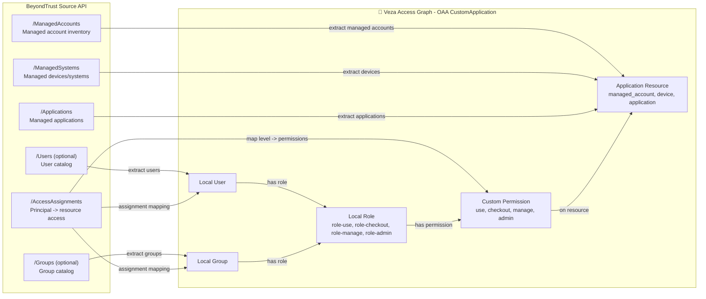

# BeyondTrust to Veza OAA Integration

## 1. Overview
This connector extracts access data from BeyondTrust and models it in Veza as a `CustomApplication`.

When `BTManagedAccounts.csv`, `BTManagedSystems.csv`, and `BTAssets.csv` are present in `--data-dir`, the script automatically switches to CSV modeling mode and builds access relationships directly from those files.

It captures:
- Managed accounts
- Devices (managed systems)
- Applications
- User/group access assignments to those resources

### Entity Model

| BeyondTrust Entity | Veza OAA Entity |
|---|---|
| Managed Account | Application Resource (`managed_account`) |
| Managed System / Device | Application Resource (`device`) |
| Application | Application Resource (`application`) |
| User principal | Local User |
| Group principal | Local Group |
| Assignment access level | Local Role + Custom Permission |

### Permission Mapping

| Source Access Level | Local Role | Custom Permissions |
|---|---|---|
| use | `role-use` | `use` |
| checkout | `role-checkout` | `use`, `checkout` |
| manage | `role-manage` | `use`, `checkout`, `manage` |
| admin | `role-admin` | `use`, `checkout`, `manage`, `admin` |

## 2. Entity Relationship Map


## 3. How It Works
1. Parse CLI flags and `.env` configuration.
2. Authenticate to BeyondTrust using API token or username/password.
3. Pull managed accounts, devices, applications, and access assignments from API endpoints.
  - If all three CSV samples are present, the script reads those files instead of calling APIs.
4. Normalize source records and permission names.
5. Build OAA `CustomApplication` payload with local users/groups, roles, resources, and grants.
6. Optionally save payload JSON for inspection.
7. Push to Veza unless `--dry-run` is set.

## 4. Prerequisites
- Linux host (RHEL/CentOS/Fedora or Ubuntu/Debian)
- Python 3.9+
- Network access from runner to:
  - BeyondTrust API base URL
  - Veza tenant (`https://<tenant>.veza.com`)
- BeyondTrust API credentials:
  - `BEYONDTRUST_API_TOKEN`, or
  - `BEYONDTRUST_USERNAME` + `BEYONDTRUST_PASSWORD`
- Veza API key with OAA push rights

## 5. Quick Start
```bash
curl -fsSL https://raw.githubusercontent.com/<org>/<repo>/main/integrations/beyondtrust/install_beyondtrust.sh | bash
```

Non-interactive install:
```bash
VEZA_URL=your-company.veza.com \
VEZA_API_KEY=*** \
BEYONDTRUST_BASE_URL=https://bt.example.com \
BEYONDTRUST_API_TOKEN=*** \
bash install_beyondtrust.sh --non-interactive
```

## 6. Manual Installation
RHEL/CentOS/Fedora:
```bash
sudo dnf install -y python3 python3-pip git curl
```

Ubuntu/Debian:
```bash
sudo apt-get update
sudo apt-get install -y python3 python3-pip python3-venv git curl
```

Then:
```bash
cd integrations/beyondtrust
python3 -m venv venv
./venv/bin/pip install -r requirements.txt
cp .env.example .env
chmod 600 .env
```

## 7. Usage

| Argument | Required | Values | Default | Description |
|---|---|---|---|---|
| `--data-dir` | No | path | `./samples` | Directory used for helper files and payload output |
| `--env-file` | No | path | `.env` | Environment file |
| `--dry-run` | No | flag | off | Build payload but skip Veza push |
| `--save-json` | No | flag | off | Save payload JSON locally |
| `--log-level` | No | `DEBUG/INFO/WARNING/ERROR` | `INFO` | Logging verbosity |
| `--provider-name` | No | string | `BeyondTrust` | Veza provider name override |
| `--datasource-name` | No | string | `BeyondTrust` | Veza datasource name override |
| `--veza-url` | Conditional | URL/host | env | Veza URL (required unless dry-run) |
| `--veza-api-key` | Conditional | string | env | Veza API key (required unless dry-run) |
| `--bt-base-url` | Yes | URL | env | BeyondTrust API base URL |
| `--bt-api-token` | Conditional | string | env | BeyondTrust bearer token |
| `--bt-username` | Conditional | string | env | BeyondTrust username if no token |
| `--bt-password` | Conditional | string | env | BeyondTrust password if no token |
| `--bt-api-key` | No | string | env | Optional `X-API-Key` header |
| `--bt-auth-endpoint` | No | endpoint | `/api/public/v3/Auth/SignAppin` | Login endpoint |
| `--managed-accounts-endpoint` | No | endpoint | `/api/public/v3/ManagedAccounts` | Managed accounts endpoint |
| `--devices-endpoint` | No | endpoint | `/api/public/v3/ManagedSystems` | Devices endpoint |
| `--applications-endpoint` | No | endpoint | `/api/public/v3/Applications` | Applications endpoint |
| `--access-assignments-endpoint` | No | endpoint | `/api/public/v3/AccessAssignments` | Access assignments endpoint |
| `--users-endpoint` | No | endpoint | empty | Optional users endpoint |
| `--groups-endpoint` | No | endpoint | empty | Optional groups endpoint |
| `--timeout-seconds` | No | integer | `30` | API timeout |
| `--insecure` | No | flag | off | Disable TLS verify |
| `--additional-headers-json` | No | JSON object | empty | Additional request headers |

Dry-run example:
```bash
cd integrations/beyondtrust
./venv/bin/python3 beyondtrust.py \
  --env-file .env \
  --data-dir ./samples \
  --dry-run \
  --save-json \
  --log-level DEBUG
```

CSV access modeling used in your current samples:
- Principals: each `ManagedAccountID` / `AccountName` becomes a Local User
- Groups: `DomainName` and `WorkgroupName` become Local Groups and users are grouped accordingly
- Resources:
  - Managed account resource from `BTManagedAccounts.csv`
  - Device resource from `BTManagedSystems.csv` (`ManagedSystemID` / `SystemName`)
  - Application resource from `BTAssets.csv` (`AssetID` / `AssetName`)
- Access edges:
  - Managed account user -> managed account resource (highest of `use|checkout|manage|admin` from flags)
  - Managed account user -> device by `ManagedSystemID` (`manage` if account is `manage/admin`, else `use`)
  - Managed account user -> application by `AssetID` (`checkout` if account is `checkout/manage/admin`, else `use`)

Flag-to-permission tuning from `BTManagedAccounts.csv`:
- `checkout` signal:
  - `CheckPasswordFlag`, `UseSelfFlag`, or `ChangePasswordAfterAnyReleaseFlag`
- `manage` signal:
  - `ManageableFlag`, `AutoManagementFlag`, `SystemAutoManagementFlag`, or `ResetPasswordOnMismatchFlag`
- `admin` signal:
  - `ApiEnabled` or `RNSSEnabledFlag`

The connector now logs a compact permission summary each run, for example:
```text
Permission summary: total=155532 | use=4200 (2.7%) | checkout=51012 (32.8%) | manage=100188 (64.4%) | admin=132 (0.1%)
Assignment scope: managed_account=51844 | device=51844 | application=51844
```

Lab/test push example:
```bash
cd integrations/beyondtrust
./venv/bin/python3 beyondtrust.py \
  --env-file .env.lab \
  --data-dir ./samples \
  --save-json \
  --log-level INFO
```

## 8. Deployment on Linux
Create dedicated service account:
```bash
sudo useradd -r -s /bin/bash -m -d /opt/beyondtrust-veza beyondtrust-veza
```

Permissions:
```bash
sudo chown -R beyondtrust-veza:beyondtrust-veza /opt/VEZA/beyondtrust-veza
sudo chmod 700 /opt/VEZA/beyondtrust-veza/scripts
sudo chmod 600 /opt/VEZA/beyondtrust-veza/scripts/.env
```

SELinux (RHEL):
```bash
getenforce
sudo restorecon -Rv /opt/VEZA/beyondtrust-veza
```

Wrapper script (`/opt/VEZA/beyondtrust-veza/scripts/run_beyondtrust.sh`):
```bash
#!/usr/bin/env bash
set -euo pipefail
cd /opt/VEZA/beyondtrust-veza/scripts
./venv/bin/python3 beyondtrust.py --env-file .env --save-json --log-level INFO
```

Cron example (`/etc/cron.d/beyondtrust-veza`):
```cron
15 * * * * beyondtrust-veza /opt/VEZA/beyondtrust-veza/scripts/run_beyondtrust.sh >> /opt/VEZA/beyondtrust-veza/logs/cron.log 2>&1
```

Log rotation example (`/etc/logrotate.d/beyondtrust-veza`):
```conf
/opt/VEZA/beyondtrust-veza/scripts/logs/*.log {
  hourly
  rotate 48
  compress
  missingok
  notifempty
  copytruncate
}
```

## 9. Multiple Instances
For multiple BeyondTrust instances:
- Use separate env files (`.env.prod`, `.env.lab`, `.env.eu`)
- Set unique `DATASOURCE_NAME` per instance
- Stagger cron schedules to reduce API load

Example:
```bash
./venv/bin/python3 beyondtrust.py --env-file .env.eu --datasource-name "BeyondTrust-EU"
```

## 10. Security Considerations
- Keep `.env` at `600` permissions and owned by dedicated service account.
- Rotate `VEZA_API_KEY` and BeyondTrust credentials regularly.
- Prefer short-lived tokens where supported.
- Avoid `--insecure` outside controlled test environments.
- Restrict outbound network paths to BeyondTrust and Veza endpoints only.

## 11. Troubleshooting
- Authentication failures:
  - Verify token validity and scope.
  - If using username/password, verify auth endpoint and account permissions.
- Connectivity issues:
  - Run `preflight.sh --all` to test network and API access.
- Missing modules:
  - Re-run `./venv/bin/pip install -r requirements.txt`.
- Empty entities in Veza:
  - Confirm API endpoints match your BeyondTrust deployment path/version.
  - Use `--save-json --log-level DEBUG` and inspect payload output.
- Veza warnings on push:
  - Review connector log output in `logs/` for warning details.

## 12. Changelog
- v1.0.0: Initial BeyondTrust connector release
